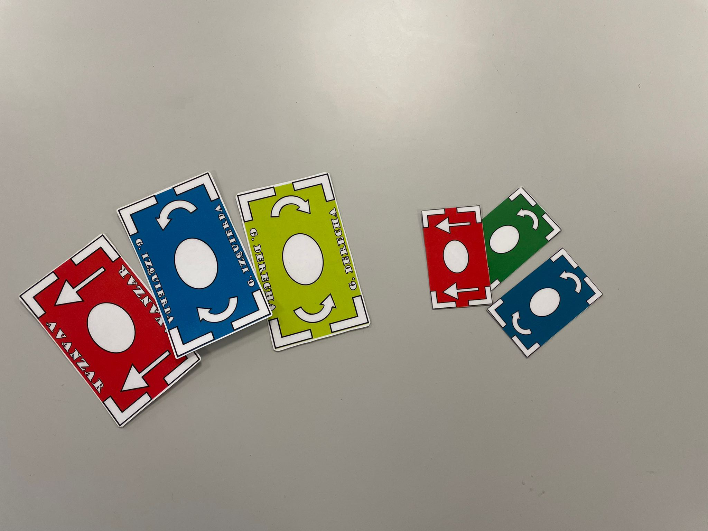
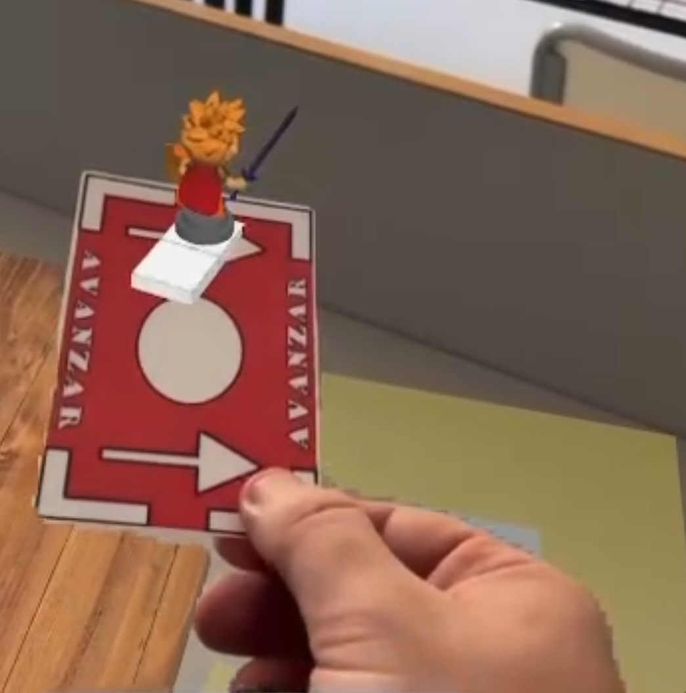
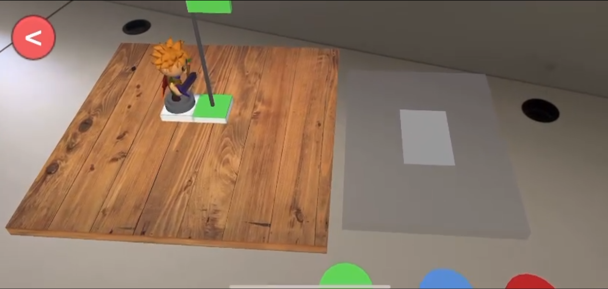

### README (English Version)

# Educational AR Game for Learning Programming

This repository is intended to showcase the progress and news of an innovative educational game project designed to introduce programming and computational thinking to students through augmented reality (AR). This project aims to create an interactive and engaging learning experience by combining traditional gaming with advanced AR technology.

## Project Description

This game is developed using Unity to ensure cross-platform compatibility, making it accessible on both Android and iOS devices. The central idea is to use physical cards that students scan with their devices to control a character's movements within the game, thus learning programming concepts in a fun and tangible way.

### Features

- **Interactive Gameplay**: Students use physical cards to input commands, enhancing engagement and retention.
- **Cross-Platform**: Available on Android and iOS devices, leveraging Unity's cross-platform capabilities.
- **Augmented Reality**: Uses AR to blend physical and digital worlds, making learning more immersive.
- **Progressive Levels**: Includes nine levels with increasing difficulty to gradually introduce new programming concepts.
- **Educational Focus**: Specifically designed for primary and early secondary school students.

### Gameplay Mechanics

1. **Game Start**: The main menu offers options to start in AR mode, non-AR mode, or exit the game.

   - 

2. **Board Placement**: In AR mode, players use their device's camera to find a flat surface where they can place the game board.

   - 

3. **Gameplay**: Players use physical cards to command their character, scanning each card to visualize the action and confirm the movement.

   - 

4. **Level Progression**: As students progress, new cards and movements are introduced, increasing the complexity and educational value.
   - 

---

### README (Spanish Version)

# Juego Educativo de AR para Aprender Programación

Este repositorio esta pensado para mostrar los avances y novedades del proyecto de un juego educativo innovador diseñado para introducir la programación y el pensamiento computacional a los estudiantes a través de la realidad aumentada (AR). Este proyecto tiene como objetivo crear una experiencia de aprendizaje interactiva y atractiva combinando el juego tradicional con la tecnología avanzada de AR.

## Descripción del Proyecto

Este juego se desarrolla utilizando Unity para asegurar la compatibilidad multiplataforma, haciéndolo accesible tanto en dispositivos Android como iOS. La idea central es usar cartas físicas que los estudiantes escanean con sus dispositivos para controlar los movimientos del personaje dentro del juego, aprendiendo así conceptos de programación de una manera divertida y tangible.

### Características

- **Juego Interactivo**: Los estudiantes usan cartas físicas para ingresar comandos, mejorando el compromiso y la retención.
- **Multiplataforma**: Disponible en dispositivos Android e iOS, aprovechando las capacidades multiplataforma de Unity.
- **Realidad Aumentada**: Utiliza AR para combinar los mundos físico y digital, haciendo que el aprendizaje sea más inmersivo.
- **Niveles Progresivos**: Incluye nueve niveles con dificultad creciente para introducir gradualmente nuevos conceptos de programación.
- **Enfoque Educativo**: Diseñado específicamente para estudiantes de primaria y secundaria temprana.

### Mecánicas de Juego

1. **Inicio del Juego**: El menú principal ofrece opciones para iniciar en modo AR, modo sin AR o salir del juego.

   - 

2. **Colocación del Tablero**: En modo AR, los jugadores usan la cámara de su dispositivo para encontrar una superficie plana donde pueden colocar el tablero de juego.

   - 

3. **Juego**: Los jugadores usan cartas físicas para comandar a su personaje, escaneando cada carta para visualizar la acción y confirmar el movimiento.

   - 

4. **Progresión de Niveles**: A medida que los estudiantes avanzan, se introducen nuevas cartas y movimientos, aumentando la complejidad y el valor educativo.
   - 
